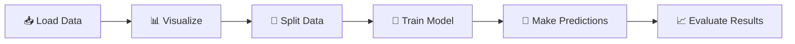

# 🎯 Simple Linear Regression 

> Master the Foundation of Predictive Modeling

---

## 🌟 What is Linear Regression?

### 💡 Simple Definition

```
Find the BEST-FIT STRAIGHT LINE through data points
to predict continuous values based on input variables
```

**Real-World Example**
Predicting 📈 **Package (Salary)** based on 🎓 **CGPA (Grades)**

The model learns: *"As CGPA increases, salary tends to increase"*

### ✨ Why Use Linear Regression?

| Feature | Benefit |
|---------|---------|
| 🎯 **Simple** | Easy to understand and interpret |
| ⚡ **Fast** | Quick to train and make predictions |
| 📊 **Baseline** | Great starting point for any project |
| 🧠 **Foundation** | Essential for advanced techniques |
| 📈 **Linear** | Perfect for linear relationships |

---

## 📐 Mathematical Foundation

### 🔴 The Core Equation

```
y = mx + b
```

> **This is the equation of a straight line!**

#### 📖 What Each Symbol Means

| Symbol | Meaning | Example |
|:------:|---------|---------|
| **y** | 🎯 Predicted Output | Package in LPA |
| **x** | 📥 Input Variable | CGPA |
| **m** | 📈 Slope/Coefficient | How steep the line is |
| **b** | 🪜 y-Intercept | Starting point on y-axis |

---

### 🧮 Finding the Best Line: The Mathematics

**Goal:** Find m and b that minimize prediction errors

#### 1️⃣ Step 1: Calculate the Slope (m)

$$m = \frac{\sum_{i=1}^{n} (X_i - \bar{X})(y_i - \bar{y})}{\sum_{i=1}^{n} (X_i - \bar{X})^2}$$

<details>
<summary><b>📝 Formula Breakdown</b></summary>

- **Σ** = Sum all values together
- **X̄** = Average of all X values  
- **ȳ** = Average of all y values
- **n** = Total number of data points

**In Simple Terms:** `Slope = How variables move together / How much X varies`

</details>

#### 2️⃣ Step 2: Calculate the Intercept (b)

$$b = \bar{y} - m \times \bar{X}$$

**What it does:** Positions the line so it passes through the center point (X̄, ȳ)

#### 3️⃣ Step 3: Make Predictions

$$\text{Prediction} = m \times \text{(new value)} + b$$

---

### 📊 Worked Example

**Given:** Model learns **m = 3.5** and **b = -5**

| CGPA | Calculation | Package (LPA) |
|:----:|:-----------:|:-------------:|
| 8.5 | 3.5 × 8.5 - 5 | **24.75** |
| 9.0 | 3.5 × 9.0 - 5 | **26.5** |
| 8.0 | 3.5 × 8.0 - 5 | **23.0** |

---

## 📁 Project Structure

```
📦 1_Simple Linear Regression/
├── 🐍 1_Simple_Linear_Regression.ipynb     ← Using Scikit-Learn (Easy)
├── 🐍 2_Simple_Linear_Regression.ipynb     ← Custom Implementation (Educational)
└── 📄 README.md                             ← You are here
```

---

## 📚 Notebook Explanations

### 📌 Notebook 1: The Practical Approach

**File:** [`1_Simple_Linear_Regression.ipynb`](1_Simple_Linear_Regression.ipynb)

> 🎯 **Purpose:** Learn about Simple linear regression purpose

---

#### 🔄 Complete Workflow



---

#### 💻 Code Breakdown

<details>
<summary><b>Step 1: Import Libraries</b></summary>

```python
import matplotlib.pyplot as plt  # 📊 Visualization
import pandas as pd             # 📋 Data handling
import numpy as np              # 🔢 Numerical operations
```

</details>

<details>
<summary><b>Step 2: Load and Explore Data</b></summary>

```python
df = pd.read_csv('../../../../Data/placement3.csv')
df.head()  # Preview first few rows
```

**What happens:** Loads student CGPA and package data 📊

</details>

<details>
<summary><b>Step 3: Visualize the Relationship</b></summary>

```python
plt.scatter(df['cgpa'], df['package'])
plt.xlabel('CGPA')
plt.ylabel('Package (in LPA)')
plt.title('CGPA vs Package')
plt.show()
```

**Why:** Check if there's a linear pattern before modeling 👁️

</details>

<details>
<summary><b>Step 4: Prepare Features and Target</b></summary>

```python
X = df.iloc[:,0:1]   # Features (input) → CGPA
y = df.iloc[:,-1]    # Target (output) → Package
```

</details>

<details>
<summary><b>Step 5: Split Data into Training & Testing</b></summary>

```python
from sklearn.model_selection import train_test_split
X_train, X_test, y_train, y_test = train_test_split(
    X, y, 
    test_size=0.2,     # 20% for testing
    random_state=2     # For reproducibility
)
```

**Why:** Test on unseen data to check real performance 🧪

</details>

<details>
<summary><b>Step 6: Create and Train the Model</b></summary>

```python
from sklearn.linear_model import LinearRegression
lr = LinearRegression()
lr.fit(X_train, y_train)  # Learn from training data
```

</details>

<details>
<summary><b>Step 7: Make Predictions</b></summary>

```python
pred_input = pd.DataFrame([[8.58]], columns=['cgpa'])
prediction = lr.predict(pred_input)
# Output: Predicted package for CGPA = 8.58
```

</details>

<details>
<summary><b>Step 8: Visualize the Fitted Line</b></summary>

```python
plt.scatter(df['cgpa'], df['package'])
plt.plot(X_train, lr.predict(X_train), color='red', linewidth=2)
plt.xlabel('CGPA')
plt.ylabel('Package (in LPA)')
plt.show()
```

</details>

<details>
<summary><b>Step 9 & 10: Extract and Use Parameters</b></summary>

```python
m = lr.coef_          # Get slope
b = lr.intercept_     # Get intercept

# Use equation directly: y = mx + b
result = m * 8.58 + b
```

</details>

---

#### ✅ Key Advantages

| ✨ Advantage | 📝 Description |
|:---:|---|
| 🎯 **Simple** | Just 2-3 lines to train |
| ⚡ **Optimized** | Built-in performance optimizations |
| 📦 **Standard** | Industry-tested & widely used |
| 🛠️ **Features** | Built-in error metrics & tools |
| 🔒 **Robust** | Handles edge cases automatically |

---

### 📌 Notebook 2: The Educational Approach

**File:** [`2_Simple_Linear_Regression.ipynb`](2_Simple_Linear_Regression.ipynb)

> 🎓 **Purpose:** Understand the mathematics by building linear regression FROM SCRATCH

---

#### 🧠 Learning Journey

```
Understand Formula → Code It → Train Model → Make Predictions
      ↓               ↓            ↓              ↓
    WHY?            HOW?         APPLY        RESULTS
```

---

#### 💻 Code Breakdown

<details>
<summary><b>Step 1-2: Create Custom Class</b></summary>

```python
class MeraLR:
    def __init__(self):
        self.m = None  # Slope parameter
        self.b = None  # Intercept parameter
```

This class will hold our model's learned parameters.

</details>

<details>
<summary><b>Step 3: Implement the fit() Method (THE MATH!)</b></summary>

```python
def fit(self, X_train, y_train):
    num = 0   # Numerator of formula
    den = 0   # Denominator of formula
    
    # Step A: Calculate components
    for i in range(X_train.shape[0]):
        num += (X_train[i] - X_train.mean()) * (y_train[i] - y_train.mean())
        den += (X_train[i] - X_train.mean()) ** 2
    
    # Step B: Apply formulas
    self.m = num / den  # Slope formula
    self.b = y_train.mean() - (self.m * X_train.mean())  # Intercept formula
```

**What's happening:**

| Step | Formula | Meaning |
|:----:|:-------:|---------|
| 1️⃣ | $\sum (X_i - \bar{X})(y_i - \bar{y})$ | Co-variation |
| 2️⃣ | $\sum (X_i - \bar{X})^2$ | X variation |
| 3️⃣ | $m = \frac{\text{Step 1}}{\text{Step 2}}$ | Slope |
| 4️⃣ | $b = \bar{y} - m \times \bar{X}$ | Intercept |

</details>

<details>
<summary><b>Step 4: Implement the predict() Method</b></summary>

```python
def predict(self, X_test):
    return self.m * X_test + self.b  # Simple: y = mx + b
```

</details>

<details>
<summary><b>Step 5: Use the Custom Model</b></summary>

```python
# Load data
df = pd.read_csv('../../../../Data/placement3.csv')
X = df.iloc[:,0].values     # Convert to numpy array
y = df.iloc[:,1].values

# Split data
X_train, X_test, y_train, y_test = train_test_split(
    X, y, test_size=0.2, random_state=2
)

# Train model
lr = MeraLR()
lr.fit(X_train, y_train)

# Make predictions
prediction = lr.predict(X_test[0])
print(f"Predicted Package: {prediction}")
```

</details>

---

## 🔑 Key Concepts Explained

### 🔀 Train-Test Split

```
Full Dataset (100%)
    ├── Training Set (80%) ← Model learns from this
    └── Testing Set (20%)  ← Model is evaluated on this
```

| Aspect | Details |
|:------:|---------|
| **Why?** | Ensure model works on NEW, unseen data |
| **Training** | 80% → What the model learns |
| **Testing** | 20% → How good is the model really? |

---

### 📈 Slope (m)

**Definition:** How much the output changes per unit change in input

```
Steep Positive Slope          Gentle Positive Slope
    y ↗                            y →
     │  CGPA ↑ = Package ↑↑         │ CGPA ↑ = Package ↑
     └────────→ x                   └────────→ x
```

| Type | Meaning | Example |
|:----:|---------|---------|
| **Positive (+)** | Both increase together | ↗ |
| **Negative (-)** | One increases, other decreases | ↘ |
| **Steep** | Large impact of X on y | High change |
| **Gentle** | Small impact of X on y | Low change |

---

### 🪜 Intercept (b)

**Definition:** The value of y when x = 0

```
        y-axis
          ↑
    b → ●────────
         │ (line crosses here)
         │
         └─────────→ x-axis
              ↑
         x = 0
```

---

### 📊 Scatter Plot

**What it shows:** Raw data as individual points

**Why it matters:** 
- ✅ Check if linear regression is appropriate
- ✅ Identify outliers or unusual patterns
- ✅ Visualize the relationship strength
- ✅ Spot non-linear patterns

---

### 📉 Regression Line

**The "best-fit" line** that minimizes prediction errors

```
Actual Data              With Regression Line
    •                         •
  •   •                      • •
 •  •  •    ────→        • •   •  
•   •   •                 •     • 
  •  •                    •      
```

---


