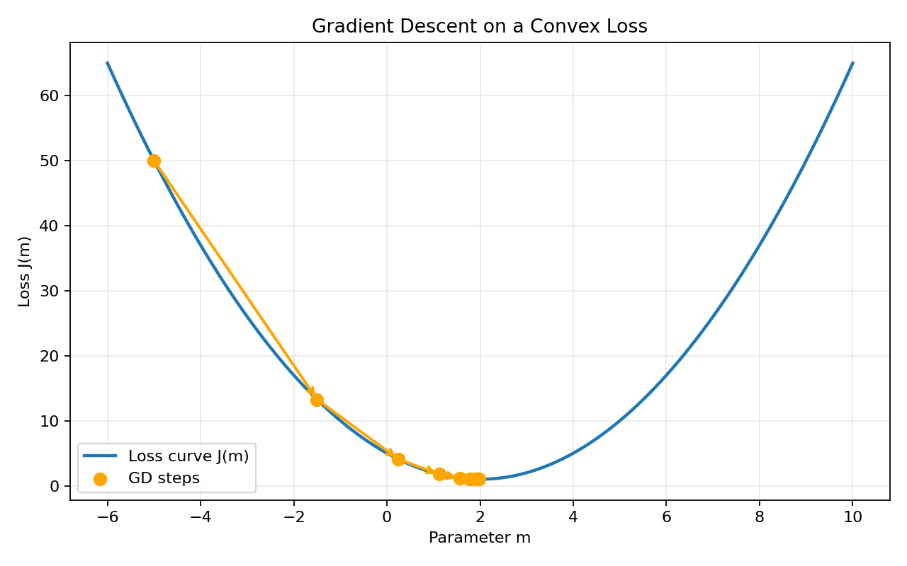

# Gradient Descent (Simple Theory + Math)

Gradient Descent (GD) is an optimization method used to find the best model parameters by reducing error step by step.

In simple words:
- The model makes a prediction.
- We measure how wrong it is using a loss function.
- We slightly update parameters in the direction that reduces the loss.
- We repeat this many times until the model becomes good enough.

## Gradient Descent Graph

The graph below shows a convex loss curve and how GD steps move toward the minimum.



## Intuition for GD

Think of a ball on a hill:
- The height of the hill is the loss value (how wrong our model is).
- The ball wants to go to the lowest point (the best model).
- At every step, the slope tells the ball which way is downhill.
- The steeper the slope, the faster the ball rolls.

GD does the same with model parameters.
- **Steep slope** (large gradient) → make bigger parameter changes to move quickly towards minimum.
- **Flat slope** (small gradient) → make small parameter changes since we're near optimal.
- **Near bottom** → very small updates because gradient is almost zero.

**Why it works:** The gradient always points in the direction of steepest increase. By going opposite to the gradient (negative gradient), we always move toward lower loss.

**Real-world analogy:** Imagine you're lost in fog on a mountain. You can't see the valley, but you can feel which way is steeper downhill. You take steps downhill. Eventually, you reach the valley. GD is like this descent process.

**In math terms:** The gradient $\nabla J(\theta)$ is a vector of partial derivatives that tells us how much each parameter needs to change.

## Mathematical Formulation of Gradient Descent

Let model parameters be represented by $\theta$ (can be slope $m$, intercept $b$, weights in neural networks, etc.).

### The Goal

We want to find parameters that minimize loss:

$$
\min_{\theta} J(\theta)
$$

where $J(\theta)$ is the loss function (error measure).

### The Update Rule

The key equation of gradient descent:

$$
\theta_{t+1} = \theta_t - \eta \nabla J(\theta_t)
$$

**Breaking it down:**
- $\theta_t$ = current parameters at iteration $t$
- $\theta_{t+1}$ = updated parameters at iteration $t+1$
- $\eta$ = learning rate (controls step size, e.g., 0.001, 0.01)
- $\nabla J(\theta_t)$ = gradient of loss w.r.t. parameters (partial derivatives)
- The **minus sign** means we move opposite to the gradient (downhill)

**Intuition:** Start with random parameters. Compute how loss changes with each parameter. Move parameters slightly in the direction that reduces loss. Repeat.

### Example: Simple Linear Regression

For predicting $y$ from input $x$:

$$
\hat{y} = mx + b
$$

Loss (Mean Squared Error):

$$
J(m,b) = \frac{1}{n}\sum_{i=1}^{n}(y_i - (mx_i + b))^2
$$

This sums up squared differences between actual ($y_i$) and predicted ($mx_i + b$) values, then averages.

**Why squared error?** Small errors are small, large errors are huge (quadratic penalty).

Partial derivatives (gradients) tell us how to adjust $m$ and $b$:

$$
\frac{\partial J}{\partial m} = -\frac{2}{n}\sum_{i=1}^{n} x_i(y_i - \hat{y}_i)
$$

$$
\frac{\partial J}{\partial b} = -\frac{2}{n}\sum_{i=1}^{n} (y_i - \hat{y}_i)
$$

The negative sign in these formulas automatically points toward loss reduction.

Update equations:

$$
m := m - \eta \frac{\partial J}{\partial m}
$$

$$
b := b - \eta \frac{\partial J}{\partial b}
$$

Both parameters update simultaneously each iteration.


## Effect of Learning Rate

The learning rate $\eta$ is critical—it controls how big each step is.

### Scenarios:

**1. Very Small Learning Rate (e.g., $\eta = 0.00001$)**
- Updates are tiny: $\theta_{t+1} \approx \theta_t$ (barely changes).
- Takes hundreds of thousands of iterations to reach minimum.
- **Pros:** Stable, unlikely to diverge.
- **Cons:** Very slow training; can get stuck before reaching minimum.

**2. Good Learning Rate (e.g., $\eta = 0.01$)**
- Updates are balanced: meaningful progress each step.
- Converges smoothly in reasonable number of iterations.
- Loss decreases steadily.
- **Ideal scenario.**

**3. Large Learning Rate (e.g., $\eta = 0.5$)**
- Updates are big: may overshoot the minimum.
- Loss oscillates up and down instead of steadily decreasing.
- May diverge (explode) if too large.
- **Example:** At minimum where gradient is near 0, a big $\eta$ can flip parameters far to the other side.

**4. Very Large Learning Rate (e.g., $\eta = 10$)**
- Parameters change wildly.
- Loss increases instead of decreases.
- Training fails completely.

### How to Choose Learning Rate:

1. **Start with a moderate value:** 0.001 to 0.01 is typical.
2. **Plot loss vs. iterations:** 
   - Smooth decrease = good $\eta$
   - Very slow decrease = too small
   - Oscillation/increase = too large
3. **Adaptive learning:** Reduce $\eta$ if loss stops improving.
4. **Context matters:** Scaled features need larger $\eta$; unscaled features need smaller.

### Example Impact:

Starting at $m = -5$ with true minimum at $m = 2$:
- $\eta = 0.01$: reaches minimum in ~200 steps.
- $\eta = 0.001$: reaches minimum in ~2000 steps.
- $\eta = 2$: oscillates wildly, may never reach minimum.

**Rule of thumb:** Monitor the training loss curve. If it's decreasing smoothly, you're good. If it's flat, learning rate is too small. If it's jumping around, learning rate is too large.

## Universality of GD

GD is one of the most powerful algorithms in ML because **almost every ML model can be framed as minimizing a loss function.**

This universality comes from the fact that:
- We define a loss function $J(\theta)$ that measures model error.
- We compute its gradient w.r.t. parameters.
- We move parameters in the direction of steepest decrease.

This works for:
- **Linear Regression:** Minimize squared error.
- **Logistic Regression:** Minimize cross-entropy loss.
- **Decision Trees (variants):** Some variants use gradient-based updates.
- **Neural Networks:** Backpropagation computes gradients efficiently; GD updates weights.
- **Support Vector Machines:** Variants use gradient descent.
- **Clustering (K-means variants):** Can be viewed as GD on a clustering loss.
- **Deep Learning:** Foundation of training; billions of parameters updated this way.
- **Recommendation Systems:** Matrix factorization uses GD.
- **Generative Models:** GANs, VAEs, diffusion models all use GD.

### Why is GD Universal?

1. **Calculus always works:** If a function is differentiable, we can compute its gradient.
2. **Gradient points downhill:** No matter the loss function, the negative gradient always reduces loss locally.
3. **Scalable:** Works for 1 parameter or billions (with distributed computing).
4. **Flexible:** Combine with batch processing, momentum, adaptive rates, etc.

### The Key Pattern:

Every ML algorithm boils down to:
1. Define a loss function (what we want to minimize).
2. Compute gradient (how each parameter affects loss).
3. Update parameters (move in direction of improvement).
4. Repeat until convergence.

This is why GD is so fundamental.

## Performing Gradient Descent by Updating `m`

Let's walk through GD step-by-step by updating only the slope `m` (keeping intercept `b` fixed). This simplifies understanding.

### Step-by-Step Process:

**Step 1: Initialize**
- Set $m = m_0$ (random, e.g., $m_0 = 3$).
- Set $b = $ some fixed value (e.g., $b = 0$).
- Choose learning rate $\eta$ (e.g., $\eta = 0.01$).
- Choose number of iterations (e.g., 100).

**Step 2: For each iteration $t = 1, 2, ..., 100$:**

**2a. Compute predictions:**
$$
\hat{y}_i = m_t \cdot x_i + b \quad \text{for all training examples}
$$

**2b. Compute error for each example:**
$$
e_i = y_i - \hat{y}_i
$$

**2c. Compute gradient:**
$$
\frac{\partial J}{\partial m} = -\frac{2}{n}\sum_{i=1}^{n} x_i \cdot e_i
$$

**2d. Update slope:**
$$
m_{t+1} = m_t - \eta \cdot \frac{\partial J}{\partial m}
$$

**2e. Compute loss (optional, for monitoring):**
$$
J_t = \frac{1}{n}\sum_{i=1}^{n} e_i^2
$$

### Concrete Example:

Suppose we have training data:
- $(x_1, y_1) = (1, 2)$
- $(x_2, y_2) = (2, 4)$
- $(x_3, y_3) = (3, 6)$

Initial: $m = 1$, $b = 0$, $\eta = 0.01$

**Iteration 1:**
- Predictions: $\hat{y}_1 = 1 \cdot 1 = 1$, $\hat{y}_2 = 1 \cdot 2 = 2$, $\hat{y}_3 = 1 \cdot 3 = 3$
- Errors: $e_1 = 2 - 1 = 1$, $e_2 = 4 - 2 = 2$, $e_3 = 6 - 3 = 3$
- Gradient: $\frac{\partial J}{\partial m} = -\frac{2}{3}(1 \cdot 1 + 2 \cdot 2 + 3 \cdot 3) = -\frac{2}{3}(14) = -9.33$
- Update: $m = 1 - 0.01 \cdot (-9.33) = 1.0933$
- Loss: $J = \frac{1}{3}(1 + 4 + 9) = 4.67$

**Iteration 2:** Repeat with $m = 1.0933$, compute new gradient, update again.

After many iterations, $m$ converges to the true value $m = 2$ (since the pattern is $y = 2x$).

### Why Update Only `m`?

Updating only one parameter helps:
- **Understand the algorithm:** Simpler to visualize and debug.
- **See gradient effect:** Clear relationship between gradient and parameter change.
- **Verify convergence:** Easy to plot slope vs. iteration.

### In Practice:

Update all parameters simultaneously (both `m` and `b`), as they interact. But the concept is identical—compute gradient for each, update each in parallel.

## Effects of Loss Function

The loss function $J(\theta)$ defines the optimization landscape. Different losses create different shapes, leading to different GD behavior.

### Common Loss Functions:

**1. Mean Squared Error (MSE)**
$$
J = \frac{1}{n}\sum_{i=1}^{n}(y_i - \hat{y}_i)^2
$$

- **Smoothness:** Very smooth, differentiable everywhere. Gradient is always well-defined.
- **Penalty:** Quadratic—errors are squared, so large errors are heavily penalized.
- **Example:** Error of 1 costs 1. Error of 10 costs 100.
- **Pros:** 
  - Smooth convergence.
  - Mathematically elegant (derivatives are simple).
  - Strongly incentivizes reducing large errors.
- **Cons:** 
  - Outliers have huge impact (one big error ruins overall loss).
  - Can make training unstable with noisy data.
- **Use when:** Data is clean; outliers are rare.

**2. Mean Absolute Error (MAE)**
$$
J = \frac{1}{n}\sum_{i=1}^{n}|y_i - \hat{y}_i|
$$

- **Smoothness:** Non-smooth at zero (gradient jumps from -1 to +1). Can be problematic near optimum.
- **Penalty:** Linear—each unit of error costs 1 unit.
- **Example:** Errors of 1 and 10 cost 1 and 10 (linear, not quadratic).
- **Pros:** 
  - Robust to outliers (outliers don't dominate).
  - Interpretable (error in same units as $y$).
- **Cons:** 
  - Less smooth (GD can be less stable).
  - Harder to minimize (gradient doesn't shrink near optimum).
- **Use when:** Data has outliers; outlier robustness matters.

**3. Huber Loss**
$$
J = \sum_{i=1}^{n} \begin{cases}
\frac{1}{2}(y_i - \hat{y}_i)^2 & \text{if } |y_i - \hat{y}_i| \leq \delta \\
\delta(|y_i - \hat{y}_i| - \frac{1}{2}\delta) & \text{otherwise}
\end{cases}
$$

- **Best of both worlds:** Smooth like MSE for small errors, robust like MAE for large errors.
- **Parameter $\delta$:** Threshold; below it acts like MSE, above it acts like MAE.
- **Pros:** 
  - Smooth (good for GD).
  - Robust to outliers (doesn't over-penalize them).
- **Cons:** 
  - Adds a hyperparameter to tune.
- **Use when:** You want MSE properties but with outlier robustness.

**4. Cross-Entropy Loss (for Classification)**
$$
J = -\frac{1}{n}\sum_{i=1}^{n} [y_i \log(\hat{y}_i) + (1-y_i) \log(1-\hat{y}_i)]
$$

- Used for classification tasks.
- Penalizes wrong confident predictions heavily.
- Very smooth for neural networks with sigmoid/softmax outputs.

### Impact on GD:

| Aspect | MSE | MAE | Huber |
|--------|-----|-----|-------|
| **Smoothness** | Very smooth | Non-smooth at 0 | Smooth |
| **Large errors** | Heavily penalized | Linearly penalized | Moderately penalized |
| **Convergence** | Fast, smooth | Can oscillate | Fast, smooth |
| **Outlier robustness** | Low | High | High |
| **Gradient stability** | Stable | Can jump | Stable |

### Choice Matters:

Different loss functions can converge to **different parameter values**:
- MSE pulls parameters to minimize large errors.
- MAE pulls parameters to minimize total absolute deviation (outliers have less influence).

**Rule of thumb:** Start with MSE for clean data. Switch to MAE or Huber if outliers are a problem.

## Effect of Data

Data quality and characteristics dramatically influence GD performance. A small change in data can change everything.

### 1. Feature Scaling

**Problem without scaling:**
- Suppose $x_1$ is in range [0, 1000] and $x_2$ is in range [0, 1].
- Loss surface becomes elongated (like a stretched ellipse).
- Gradient is huge in the $x_1$ direction, tiny in $x_2$ direction.
- GD zigzags: small steps in $x_1$ direction, overshoots in $x_2$ direction.
- Convergence is slow or fails.

**Solution: Standardization**
$$
x'_i = \frac{x_i - \mu}{\sigma}
$$
- Subtract mean, divide by standard deviation.
- Puts all features around [-3, 3] range.
- Creates more circular loss surface.
- GD converges much faster (maybe 10-100x).

**Example:**
```
Without scaling: 1000 iterations to converge
With scaling: 50 iterations to converge
```

### 2. Outliers

**Effect on MSE:**
- Single outlier with error 100 produces loss term $100^2 = 10,000$.
- Gradient pulls parameters hard to correct this one point.
- Parameters become biased toward outlier (bad for predicting normal data).

**Example:**
- True relationship: $y = 2x$
- Outlier: $(x=5, y=1000)$ (should be ~10)
- MSE loss: Pulls slope $m$ toward ~200 to fit outlier.
- Predictions: Terrible for normal data.

**Solutions:**
- Use robust loss (MAE, Huber).
- Detect and remove outliers (statistical tests).
- Clamp outlier values.
- Use higher learning rate initially (can jump over outliers).

### 3. Noise

**Effect of noisy labels:**
- Suppose true $y_i = 2x_i$ but labels are corrupted by random noise.
- Model tries to fit noise, leading to overfitting.
- GD converges, but to wrong parameters.

**Example:**
- 100 data points: 90 satisfy $y=2x$, 10 are random (noise).
- GD might converge to $m = 1.95$ trying to fit the noise points too.
- Performs worse on test data.

**Mitigation:**
- Use regularization (add penalty for complex models).
- Check train vs. validation loss (gap indicates overfitting).
- Use more data (noise effect diminishes).
- Early stopping (stop training when validation loss increases).

### 4. Feature Correlation

**Problem:**
- If two features are highly correlated, loss surface becomes narrow, elongated valley.
- Parameter updates in one direction dwarf the other.
- GD zigzags down the valley instead of straight down.
- Reaches minimum but slowly.

**Example:**
- Features: temperature (Celsius) and temperature (Fahrenheit)—perfectly correlated.
- GD struggles because both do the same job; small changes create large loss swings.

**Solutions:**
- Remove redundant features.
- Use dimensionality reduction (PCA).
- Apply regularization to discourage fitting both.

### 5. Data Amount

**Small dataset:**
- GD can overfit (memorizes data).
- Gradient is noisy (few examples to estimate true direction).
- High variance in parameter estimates.

**Large dataset:**
- GD converges to true parameters.
- Gradient is stable (averaged over many examples).
- More robust to noise and outliers.

**Rule of thumb:** More data is almost always better.

### 6. Data Distribution

**Imbalanced classification:**
- If 99% of data is class A and 1% is class B.
- Model biases toward predicting A (appears to perform well on test set).
- Misses rare but important class B.

**Solutions:**
- Use stratified sampling in train/test split.
- Adjust loss weights (penalize B errors more).
- Use recall/precision as metrics instead of accuracy.

### Good Practices:

1. **Standardize/Normalize features:**
   ```python
   from sklearn.preprocessing import StandardScaler
   scaler = StandardScaler()
   X_scaled = scaler.fit_transform(X)
   ```

2. **Detect outliers:**
   - Plot data.
   - Use z-score or IQR method.
   - Consider domain knowledge (is it real or error?).

3. **Check data quality:**
   - Missing values?
   - Duplicates?
   - Wrong data types?

4. **Visualize data:**
   - Scatter plots to see patterns.
   - Histograms to check distributions.
   - Correlation matrix to find redundant features.

5. **Train/validation/test split:**
   - Monitor validation loss during training.
   - Stop if validation loss increases (overfitting).

6. **Use multiple metrics:**
   - Don't rely solely on training loss.
   - Check MSE, MAE, R², precision, recall etc.

**Summary:** GD is powerful, but garbage in = garbage out. High-quality, well-prepared data is half the battle in ML.


---
