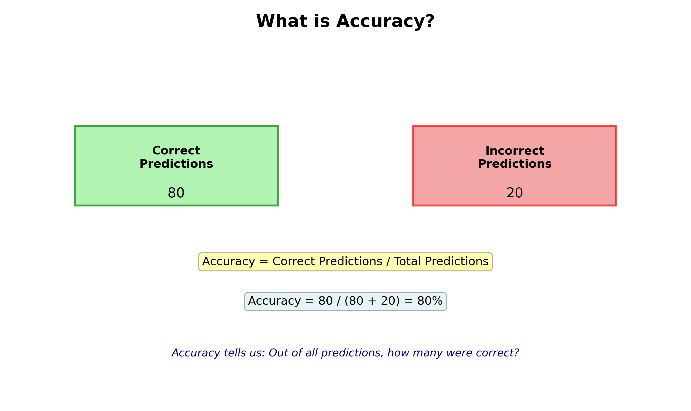
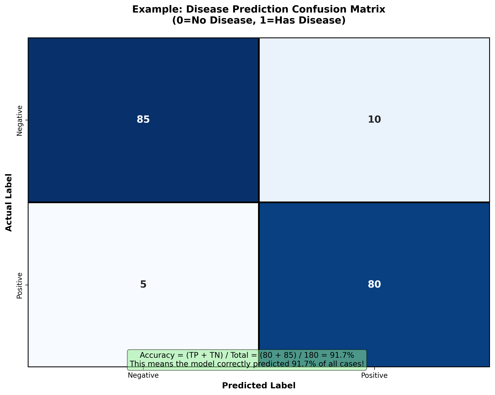

# Classification Metrics: Accuracy & Confusion Matrix

## Table of Contents

- [Overview](#overview)
- [1. Accuracy](#1-accuracy)
  - [What is Accuracy?](#what-is-accuracy)
  - [Formula](#formula)
  - [Visual Explanation](#visual-explanation)
  - [Simple Example](#simple-example)
  - [When to Use Accuracy](#when-to-use-accuracy)
  - [When NOT to Use Accuracy](#when-not-to-use-accuracy)
- [When Accuracy is Misleading ⚠️](#when-accuracy-is-misleading-️)
  - [The Problem with Accuracy](#the-problem-with-accuracy)
  - [Real Example: The Useless Model Problem](#real-example-the-useless-model-problem)
  - [Why is This Happening?](#why-is-this-happening)
  - [The Real Problem](#the-real-problem)
  - [Another Example: Spam Detection](#another-example-spam-detection)
  - [When Accuracy is Most Misleading](#when-accuracy-is-most-misleading)
  - [How to Spot If Accuracy is Misleading](#how-to-spot-if-accuracy-is-misleading)
  - [The Solution: Don&#39;t Use Accuracy Alone!](#the-solution-dont-use-accuracy-alone)
  - [Key Takeaway](#key-takeaway)
- [2. Confusion Matrix](#2-confusion-matrix)
  - [What is a Confusion Matrix?](#what-is-a-confusion-matrix)
  - [Breaking Down Each Cell](#breaking-down-each-cell)
  - [Real Example](#real-example)
  - [Useful Metrics Derived from Confusion Matrix](#useful-metrics-derived-from-confusion-matrix)
  - [When Confusion Matrix is Useful](#when-confusion-matrix-is-useful)
- [3. Type 1 and Type 2 Errors](#3-type-1-and-type-2-errors)
  - [What Are Type 1 and Type 2 Errors?](#what-are-type-1-and-type-2-errors)
  - [Type 1 Error (False Positive)](#type-1-error-false-positive)
  - [Type 2 Error (False Negative)](#type-2-error-false-negative)
  - [Visual Comparison](#visual-comparison)
  - [Which Error is Worse?](#which-error-is-worse)
  - [Example with Numbers](#example-with-numbers)
  - [Controlling Type 1 and Type 2 Errors](#controlling-type-1-and-type-2-errors)
  - [Example: Email Spam Filter](#example-email-spam-filter)
- [4. Precision, Recall, and F1 Score](#4-precision-recall-and-f1-score)
  - [What is Precision?](#what-is-precision)
  - [What is Recall?](#what-is-recall)
  - [What is F1 Score?](#what-is-f1-score)
  - [The Precision-Recall Trade-off](#the-precision-recall-trade-off)
  - [Real Examples](#real-examples-precision-recall-f1)
  - [When to Use Each Metric](#when-to-use-each-metric)
  - [Comparison Table](#comparison-table-precision-recall-f1)
- [5. ROC Curve and ROC-AUC](#5-roc-curve-and-roc-auc)
  - [What is a ROC Curve?](#what-is-a-roc-curve)
  - [Understanding True Positive Rate (TPR)](#understanding-true-positive-rate-tpr)
  - [Understanding False Positive Rate (FPR)](#understanding-false-positive-rate-fpr)
  - [What is ROC-AUC (Area Under the Curve)?](#what-is-roc-auc-area-under-the-curve)
  - [How to Interpret ROC Curves](#how-to-interpret-roc-curves)
  - [Perfect vs Poor Models](#perfect-vs-poor-models)
  - [Reading ROC-AUC Values](#reading-roc-auc-values)
  - [ROC Curve with Real Example](#roc-curve-with-real-example)
  - [When to Use ROC-AUC](#when-to-use-roc-auc)
  - [ROC-AUC vs Other Metrics](#roc-auc-vs-other-metrics)
  - [Advantages and Disadvantages](#advantages-and-disadvantages)
- [Comparison: Accuracy vs Confusion Matrix](#comparison-accuracy-vs-confusion-matrix)

## Overview

When we build classification models (models that predict categories like Yes/No, Pass/Fail, etc.), we need ways to measure how well they perform. The two fundamental metrics for this are **Accuracy** and **Confusion Matrix**.

---

## 1. Accuracy

### What is Accuracy?

**Accuracy** is the simplest metric to understand. It tells you: **Out of all your predictions, how many were correct?**

### Formula

```
Accuracy = Number of Correct Predictions / Total Number of Predictions
Accuracy = (TP + TN) / (TP + TN + FP + FN)
```

### Visual Explanation



### Simple Example

Imagine a weather prediction model makes 100 predictions:

- ✓ **Correct predictions: 80**
- ✗ **Wrong predictions: 20**

Then: **Accuracy = 80/100 = 80%**

This means the model is correct 8 out of 10 times.

### When to Use Accuracy

- ✓ When all classes (categories) are equally important
- ✓ When the dataset is balanced (similar number of each class)
- ✓ For quick overall model performance check

### When NOT to Use Accuracy

- ✗ When classes are imbalanced (e.g., 95% healthy, 5% sick)
- ✗ When one type of error is more costly than another
- ✗ When you need to understand different types of mistakes

---

## When Accuracy is Misleading ⚠️

### The Problem with Accuracy

Accuracy can **trick you into thinking your model is great when it's actually terrible**. This happens especially with **imbalanced datasets**.

### Real Example: The Useless Model Problem

Imagine you build a disease detection model with this dataset:

- Total patients: **1000**
- Actually have disease: **10** (1%)
- Actually healthy: **990** (99%)

#### Scenario 1: Your "Smart" Model

Your model:

- Correctly identifies 8 sick patients (TP = 8)
- Correctly identifies 980 healthy people (TN = 980)
- Misses 2 sick patients (FN = 2)
- False alarms for 10 healthy people (FP = 10)

```
Accuracy = (8 + 980) / 1000 = 988 / 1000 = 98.8%
```

**Wow! 98.8% accuracy! That seems great!**

#### Scenario 2: The Lazy "Useless" Model

But wait... what if your model is **completely dumb** and just predicts "Everyone is healthy" for every patient?

```
Prediction: Healthy for ALL 1000 patients

Accuracy = 990 / 1000 = 99%
```

**The useless model has 99% accuracy!** 😱

### Why is This Happening?

Because the dataset is **imbalanced**:

- 99% of patients are healthy
- 1% have the disease

When you just predict "Healthy" for everyone, you're automatically correct 99% of the time, **even though you're not catching any sick patients!**

### The Real Problem

The "useless" model has:

- ✓ 99% accuracy
- ✗ 0 sick patients detected (caught 0 out of 10)
- ✗ Completely useless for diagnosis

Your better model has:

- ✓ 98.8% accuracy (slightly lower)
- ✓ Actually catches 80% of sick patients
- ✓ Much more useful!

### Another Example: Spam Detection

Email dataset:

- Total emails: **10,000**
- Spam emails: **100** (1%)
- Legitimate emails: **9,900** (99%)

Model that just predicts "Legitimate" for everything:

```
Accuracy = 9,900 / 10,000 = 99%
```

**Your spam filter has 99% accuracy but catches ZERO spam emails!** 🚫

### When Accuracy is Most Misleading

| Scenario                          | Accuracy Shows     | Reality Is                        |
| --------------------------------- | ------------------ | --------------------------------- |
| **Imbalanced data**         | Looks great (99%+) | Model may be useless              |
| **One class dominates**     | High numbers       | Model ignores minority class      |
| **Cost-sensitive problems** | Misleading         | Missing rare cases is very costly |
| **Medical diagnosis**       | Deceptive          | Missing diseases kills people     |
| **Fraud detection**         | Deceptive          | Missing fraud costs money         |

### How to Spot If Accuracy is Misleading

Ask yourself these questions:

1. **Is my data imbalanced?**

   - Count: How many of each class do I have?
   - If one class is much larger (>70%), be careful with accuracy
2. **What happens if my model predicts the majority class only?**

   - Calculate: What would accuracy be?
   - If it's similar to your model's accuracy, that's a red flag!
3. **Which type of error is more costly?**

   - Missing a sick patient (Type 2 error) = Life-threatening
   - False alarm for healthy person (Type 1 error) = Worried person
   - These aren't equal in cost!

### The Solution: Don't Use Accuracy Alone!

When you have **imbalanced data** or **cost-sensitive problems**, use these metrics instead or in addition to accuracy:

1. **Precision**: "When model says positive, how often is it right?"
2. **Recall**: "Did we catch all the positive cases?"
3. **F1-Score**: Balanced combination of precision and recall
4. **Confusion Matrix**: See the real breakdown
5. **ROC-AUC**: Good for imbalanced data
6. **PR-AUC**: For highly imbalanced data

### Key Takeaway

**⚠️ Always check the confusion matrix before celebrating high accuracy!**

High accuracy + imbalanced data = Potential trap 🪤

---

## 2. Confusion Matrix

### What is a Confusion Matrix?

A **Confusion Matrix** is a table that shows **in detail** what types of mistakes your model makes. Instead of just giving you one number (like accuracy), it breaks down predictions into 4 categories:

#### For Binary Classification (2 classes):

|                         | Predicted: No       | Predicted: Yes      |
| ----------------------- | ------------------- | ------------------- |
| **Actually: No**  | TN (True Negative)  | FP (False Positive) |
| **Actually: Yes** | FN (False Negative) | TP (True Positive)  |

### Breaking Down Each Cell

1. **TP (True Positive)** - Model predicted **Yes**, Actually **Yes**

   - ✓ CORRECT! The model caught the positive case.
   - Example: Predicted disease, patient has disease.
2. **TN (True Negative)** - Model predicted **No**, Actually **No**

   - ✓ CORRECT! The model correctly identified a negative case.
   - Example: Predicted no disease, patient is healthy.
3. **FP (False Positive)** - Model predicted **Yes**, Actually **No**

   - ✗ WRONG! False alarm.
   - Example: Predicted disease, but patient is healthy.
4. **FN (False Negative)** - Model predicted **No**, Actually **Yes**

   - ✗ WRONG! Missed the case.
   - Example: Predicted no disease, but patient has disease.

### Real Example



#### Disease Prediction Example:

```
Predicted →
Actual ↓       |  Healthy (No)  |  Sick (Yes)  |
─────────────────────────────────────────────────
Healthy (No)   |      85        |      10      |
─────────────────────────────────────────────────
Sick (Yes)     |       5        |      80      |
─────────────────────────────────────────────────
```

- **TP = 80**: Model correctly identified 80 sick patients
- **TN = 85**: Model correctly identified 85 healthy people
- **FP = 10**: Model said 10 people were sick (but they're healthy) - False alarm
- **FN = 5**: Model said 5 people were healthy (but they're sick) - Missed cases

### Useful Metrics Derived from Confusion Matrix

Once you have the confusion matrix, you can calculate many other metrics:

1. **Accuracy** = (TP + TN) / Total

   - For example: (80 + 85) / 180 = 91.7%
2. **Precision** = TP / (TP + FP)

   - Of all cases we predicted as positive, how many were actually positive?
   - Answers: "When the model says YES, how often is it right?"
3. **Recall (Sensitivity)** = TP / (TP + FN)

   - Of all actual positive cases, how many did we catch?
   - Answers: "Did we find all the positive cases?"
4. **Specificity** = TN / (TN + FP)

   - Of all actual negative cases, how many did we correctly identify?
   - Answers: "Did we correctly reject negative cases?"
5. **F1-Score** = 2 × (Precision × Recall) / (Precision + Recall)

   - Balances precision and recall when they're both important

### When Confusion Matrix is Useful

- ✓ Understanding what types of mistakes the model makes
- ✓ Imbalanced datasets (different number of classes)
- ✓ When different errors have different costs
- ✓ Tuning the model for specific priorities (catch more positives vs. fewer false alarms)

---

## 3. Type 1 and Type 2 Errors

### What Are Type 1 and Type 2 Errors?

Type 1 and Type 2 errors come from **hypothesis testing** in statistics. These errors describe the two ways your model can be **wrong**:

### Type 1 Error (False Positive)

**Type 1 Error** = **False Positive (FP)**

- **What it is**: You **reject** something that is actually **true**. Your model says "YES" when the truth is "NO".
- **In simple terms**: A false alarm
- **Think of it as**: Incorrectly identifying something that isn't there

#### Real Examples:

1. **Medical Diagnosis**

   - Model says: "You have disease"
   - Reality: "You don't have disease"
   - Consequence: Unnecessary worry and treatment costs
2. **Spam Detection**

   - Model says: "This is spam"
   - Reality: "It's a legitimate email"
   - Consequence: You miss an important email
3. **Fraud Detection**

   - Model says: "This transaction is fraudulent"
   - Reality: "It's a legitimate transaction"
   - Consequence: Customer's card gets blocked unnecessarily

### Type 2 Error (False Negative)

**Type 2 Error** = **False Negative (FN)**

- **What it is**: You **fail to reject** something that is actually **false**. Your model says "NO" when the truth is "YES".
- **In simple terms**: A missed case
- **Think of it as**: Failing to identify something that is there

#### Real Examples:

1. **Medical Diagnosis**

   - Model says: "You don't have disease"
   - Reality: "You do have disease"
   - Consequence: Disease goes untreated (very dangerous!)
2. **Spam Detection**

   - Model says: "This is legitimate"
   - Reality: "It's actually spam"
   - Consequence: Spam reaches your inbox
3. **Fraud Detection**

   - Model says: "Transaction is legitimate"
   - Reality: "It's actually fraudulent"
   - Consequence: Fraud goes undetected (company loses money)

### Visual Comparison

| Error Type             | What Happened | Prediction | Reality | Type | Severity Often |
| ---------------------- | ------------- | ---------- | ------- | ---- | -------------- |
| **Type 1 Error** | False Alarm   | YES        | NO      | FP   | Varies         |
| **Type 2 Error** | Missed Case   | NO         | YES     | FP   | Often High     |

### Which Error is Worse?

**It depends on your problem!**

#### When Type 1 Error (FP) is Worse:

- **Spam Filters**: False positives delete important emails
- **Fraud Alerts**: False alerts annoy customers
- **Ads**: Showing wrong ads wastes money
- **In general**: When false alarms are expensive or annoying

#### When Type 2 Error (FN) is Worse:

- **Medical Diagnosis**: Missing a disease can be life-threatening
- **Security**: Missing a terrorist threat is catastrophic
- **Defect Detection**: Missing a defective product harms customers
- **In general**: When missing something is dangerous or costly

### Example with Numbers

From our disease prediction example:

```
                  Predicted Healthy    Predicted Sick
Actually Healthy         85                  10  ← Type 1 Errors (FP)
Actually Sick             5  ← Type 2 Errors (FN)    80
```

- **Type 1 Errors = 10**: 10 healthy people incorrectly told they're sick
- **Type 2 Errors = 5**: 5 sick people incorrectly told they're healthy

### Controlling Type 1 and Type 2 Errors

You can adjust your model to reduce one type of error, but **increasing one usually increases the other**:

```
More Strict (Reduce FP)          More Lenient (Reduce FN)
├─ Higher threshold                ├─ Lower threshold
├─ Fewer false alarms             ├─ Catch more cases
├─ More Type 2 Errors             ├─ More Type 1 Errors
└─ Lower Recall, Higher Precision  └─ Higher Recall, Lower Precision
```

### Example: Email Spam Filter

If you make the filter **very strict**:

- ✓ Few spam emails (low FP) get through
- ✗ Many legitimate emails get blocked (high FN)

If you make the filter **very lenient**:

- ✓ Few legitimate emails get blocked (low FN)
- ✗ Many spam emails (high FP) get through

---

## 4. Precision, Recall, and F1 Score

### What is Precision?

**Precision** answers the question: **"When our model predicts POSITIVE, how often is it correct?"**

In other words: Of all the cases we predicted as positive, how many were actually positive?

### Formula

```
Precision = TP / (TP + FP)
Precision = True Positives / All Predicted Positives
```

### Explanation

- **TP (True Positives)**: Cases we correctly predicted as positive
- **FP (False Positives)**: Cases we incorrectly predicted as positive (false alarms)
- **Denominator**: All cases we predicted as positive (both correct and incorrect)

### Visual Example

Imagine a disease detection model makes predictions:

- Model says "SICK" for 90 patients
- Of those 90:
  - 80 actually have the disease (TP = 80)
  - 10 don't have the disease (FP = 10)

```
Precision = 80 / (80 + 10) = 80 / 90 = 88.9%
```

**Meaning**: When the model says someone is sick, it's correct 88.9% of the time.

### When to Use Precision

- ✓ **Spam Detection**: You care about not blocking legitimate emails
- ✓ **Fraud Detection**: You care about not falsely flagging legitimate transactions
- ✓ **Email Classification**: False positives are expensive
- ✓ **Advertisement**: False positives waste ad budget
- ✓ When **false alarms are costly**

### When NOT to Use Precision Alone

- ✗ When missing positive cases is very dangerous (medical diagnosis)
- ✗ When you need to catch ALL positive cases
- ✗ When false negatives are more costly than false positives

---

### What is Recall?

**Recall** answers the question: **"Of all the ACTUAL positive cases, how many did we catch?"**

In other words: Out of all the cases that were actually positive, how many did our model correctly identify?

### Formula

```
Recall = TP / (TP + FN)
Recall = True Positives / All Actual Positives
```

### Explanation

- **TP (True Positives)**: Cases we correctly predicted as positive
- **FN (False Negatives)**: Cases we incorrectly predicted as negative (missed cases)
- **Denominator**: All cases that were actually positive (both caught and missed)

### Visual Example

Imagine a disease detection model:

- There are 100 patients who actually have the disease
- Of those 100:
  - Model correctly identifies 80 (TP = 80)
  - Model misses 20 (FN = 20)

```
Recall = 80 / (80 + 20) = 80 / 100 = 80%
```

**Meaning**: The model catches 80% of all sick patients. It misses 20% of the sick people.

### When to Use Recall

- ✓ **Medical Diagnosis**: You must catch all disease cases
- ✓ **Security**: You must detect all threats
- ✓ **Cancer Detection**: Missing cancer is life-threatening
- ✓ **Product Defects**: Missing defects harms customers
- ✓ When **missing positive cases is very dangerous**

### When NOT to Use Recall Alone

- ✗ When false alarms are very expensive
- ✗ When you need high precision
- ✗ When false positives cause harm

---

### What is F1 Score?

**F1 Score** is the **harmonic mean** of Precision and Recall. It combines both metrics into a single number.

### Formula

```
F1 = 2 × (Precision × Recall) / (Precision + Recall)
```

### Explanation

The F1 Score:

- Uses both precision and recall
- Gives equal weight to both metrics
- Produces a single number between 0 and 1 (or 0-100%)
- **1.0** = Perfect (all predictions correct)
- **0.0** = Worst possible
- **0.5** = Average

### Why "Harmonic Mean" and Not Regular Average?

Because the harmonic mean **penalizes extreme imbalances**:

#### Example: Why Harmonic Mean is Better

Suppose:

- Model 1: Precision = 90%, Recall = 10%
- Model 2: Precision = 50%, Recall = 50%

**Using regular average:**

- Model 1: (90 + 10) / 2 = 50% (misleading!)
- Model 2: (50 + 50) / 2 = 50%
- They seem equal

**Using harmonic mean (F1):**

- Model 1: 2 × (90 × 10) / (90 + 10) = 1800 / 100 = 18%
- Model 2: 2 × (50 × 50) / (50 + 50) = 5000 / 100 = 50%
- Model 2 is clearly better

The harmonic mean properly shows that having one very good and one bad metric isn't great overall.

### Visual Example

From our disease detection model:

```
Precision = 80% (of predicted sick, 80% are actually sick)
Recall = 80% (of actual sick, we catch 80%)

F1 = 2 × (0.80 × 0.80) / (0.80 + 0.80)
F1 = 2 × 0.64 / 1.60
F1 = 1.28 / 1.60
F1 = 0.80 or 80%
```

### When to Use F1 Score

- ✓ **Imbalanced datasets**: When classes are unequal in size
- ✓ **When both precision and recall matter**: You care about false positives AND false negatives
- ✓ **General classification**: A good default metric
- ✓ When you want **one overall score** instead of multiple metrics

---

### The Precision-Recall Trade-off

**Key Insight**: You usually **cannot maximize both precision and recall simultaneously**. Improving one often means sacrificing the other.

### How the Trade-off Works

Imagine adjusting your model's decision threshold:

```
Lower Threshold (More Lenient)      Higher Threshold (More Strict)
├─ Predict "Positive" more often      ├─ Predict "Positive" less often
├─ Catch more positive cases          ├─ Fewer false alarms
├─ Higher Recall                      ├─ Higher Precision
├─ Lower Precision                    ├─ Lower Recall
└─ More False Positives               └─ More False Negatives
```

### Visual Graph

```
        Precision
        |     ╱─────╲
        |    ╱       ╲
        |   ╱         ╲ ← Precision Curve
        |  ╱           ╲
    100%├─┼─────────────┼──
        | ╱             ╲
        |╱_____________╲╲___
        |               ╲ ╲
        |                ╲ ╲ ← Recall Curve
      0%├──────────────────╲─────
        └────────────────────────
                Threshold
```

As you change the threshold:

- Decreasing threshold → Recall goes UP, Precision goes DOWN
- Increasing threshold → Precision goes UP, Recall goes DOWN

### Real Example: Medical Diagnosis

**Strict Model (High Precision):**

```
Threshold: Very high confidence needed
Result:
- Only predicts "sick" when very confident
- Few false alarms (high precision)
- Misses some genuine cases (low recall)
- Some sick patients sent home untreated ✗
```

**Lenient Model (High Recall):**

```
Threshold: Low confidence needed
Result:
- Predicts "sick" more often
- Catches almost all real cases (high recall)
- Many false alarms (low precision)
- Healthy people get unnecessary treatment ✗
```

**Balanced Model (Good F1):**

```
Threshold: Moderate confidence
Result:
- Catches most real cases
- Reasonable false alarm rate
- Good balance overall
```

---

### Real Examples (Precision, Recall, F1)

#### Example 1: Medical Diagnosis System

Dataset: 1000 patients, 100 actually have disease

**Model Predictions:**

```
                  Predicted Sick    Predicted Healthy
Actually Sick          80                   20  (FN)
Actually Healthy       10                  890  (TN)
                       (FP)
```

**Calculations:**

```
Precision = TP / (TP + FP) = 80 / (80 + 10) = 80 / 90 = 88.9%
Recall = TP / (TP + FN) = 80 / (80 + 20) = 80 / 100 = 80%
F1 = 2 × (0.889 × 0.80) / (0.889 + 0.80) = 84.2%
```

**Interpretation:**

- 88.9% of predicted sick patients are actually sick (good precision)
- But we miss 20% of actual sick patients (lower recall)
- F1 Score of 84.2% shows overall decent balance
- **Action**: Consider lowering threshold to catch more sick patients

---

#### Example 2: Spam Detection

Dataset: 10,000 emails, 100 actually spam

**Model Predictions:**

```
                  Predicted Spam    Predicted Legitimate
Actually Spam         85                    15  (FN)
Actually Legitimate   50                  9850  (TN)
                      (FP)
```

**Calculations:**

```
Precision = TP / (TP + FP) = 85 / (85 + 50) = 85 / 135 = 62.96%
Recall = TP / (TP + FN) = 85 / (85 + 15) = 85 / 100 = 85%
F1 = 2 × (0.6296 × 0.85) / (0.6296 + 0.85) = 73.1%
```

**Interpretation:**

- Only 63% of flagged emails are actually spam (low precision)
- We catch 85% of spam (good recall)
- F1 Score of 73.1% is moderate
- **Action**: Increase threshold to reduce false positives (users missing emails is bad)

---

#### Example 3: Credit Card Fraud Detection

Dataset: 1,000,000 transactions, 1000 actually fraudulent

**Model Predictions:**

```
                      Predicted Fraud    Predicted Legitimate
Actually Fraud             950                    50  (FN)
Actually Legitimate      1000                999000  (TN)
                         (FP)
```

**Calculations:**

```
Precision = TP / (TP + FP) = 950 / (950 + 1000) = 950 / 1950 = 48.7%
Recall = TP / (TP + FN) = 950 / (950 + 50) = 950 / 1000 = 95%
F1 = 2 × (0.487 × 0.95) / (0.487 + 0.95) = 64.3%
```

**Interpretation:**

- Only 48.7% of flagged transactions are actually fraud (low precision)
  - But blocking the transaction is reversible
- We catch 95% of fraud (excellent recall)
  - Missing fraud costs money
- F1 Score of 64.3% reflects the imbalance
- **Action**: This is acceptable! Catching fraud is worth customer inconvenience

---

### When to Use Each Metric

| Use Case                       | Best Metric | Why                                           |
| ------------------------------ | ----------- | --------------------------------------------- |
| **Medical Diagnosis**    | Recall      | Must catch all diseases; missing is dangerous |
| **Spam Filters**         | Precision   | False positives block important emails        |
| **Fraud Detection**      | Recall      | Catching theft worth customer inconvenience   |
| **Email Classification** | Precision   | Misclassifying wastes user time               |
| **Cancer Detection**     | Recall      | Missing cancer is life-threatening            |
| **Loan Approval**        | Precision   | False positives cost bank money               |
| **Overall Model Eval**   | F1 Score    | When both precision and recall matter equally |
| **Imbalanced Data**      | F1 Score    | Handles class imbalance better                |
| **Want One Metric**      | F1 Score    | Combines precision and recall                 |

---

### Comparison Table (Precision, Recall, F1)

| Aspect                     | Precision                   | Recall                    | F1 Score            |
| -------------------------- | --------------------------- | ------------------------- | ------------------- |
| **Measures**         | False alarm rate            | Missing rate              | Overall balance     |
| **Formula**          | TP / (TP+FP)                | TP / (TP+FN)              | 2×(P×R)/(P+R)     |
| **Answers**          | "How sure are predictions?" | "Did we catch all cases?" | "How good overall?" |
| **High value means** | Few false alarms            | Few missed cases          | Good balance        |
| **Low value means**  | Many false alarms           | Many missed cases         | Poor balance        |
| **Best for**         | Cost of FP is high          | Cost of FN is high        | Both matter equally |
| **Range**            | 0 to 1 (0% to 100%)         | 0 to 1 (0% to 100%)       | 0 to 1 (0% to 100%) |

---

## 5. ROC Curve and ROC-AUC

### What is a ROC Curve?

A **ROC Curve** (Receiver Operating Characteristic Curve) is a graph that shows **how well your classification model performs across different decision thresholds**.

Instead of just evaluating your model at one threshold, the ROC curve visualizes performance at **all possible thresholds**.

### Understanding True Positive Rate (TPR)

**TPR (True Positive Rate)** is the same as **Recall**:

```
TPR = TP / (TP + FN)
```

**What it measures**: Of all actual positive cases, how many did we correctly identify?

**Range**: 0 to 1 (0% to 100%)
- TPR = 1.0 means we caught all positive cases
- TPR = 0.0 means we missed all positive cases

### Understanding False Positive Rate (FPR)

**FPR (False Positive Rate)** is the complement of **Specificity**:

```
FPR = FP / (FP + TN)
```

**What it measures**: Of all actual negative cases, how many did we incorrectly classify as positive (false alarms)?

**Range**: 0 to 1 (0% to 100%)
- FPR = 0.0 means no false alarms (perfect specificity)
- FPR = 1.0 means we flagged all negatives as positive

### What is ROC-AUC (Area Under the Curve)?

**ROC-AUC** is a **single number** that summarizes the entire ROC curve:

- **AUC** = Area Under the ROC Curve
- **Value range**: 0 to 1 (often expressed as 0% to 100%)
- It represents the **probability that the model ranks a random positive example higher than a random negative example**

#### How AUC is Calculated

The AUC is calculated by finding the area under the ROC curve:

```
        TPR (Sensitivity)
        |
      1 ├──────────────┐
        |     /        │
      0.5├────/────────┤  ← AUC = Area of shaded region
        |  /          │
      0 └──────────────┴────────
        0    0.5      1
              FPR (1 - Specificity)
```

You don't need to calculate this manually—sklearn and other libraries do it for you!

### How to Interpret ROC Curves

#### Key Points on the Graph

1. **Bottom-left corner (0, 0)**
   - FPR = 0, TPR = 0
   - Meaning: No false positives, but also no true positives (too conservative)

2. **Top-right corner (1, 1)**
   - FPR = 1, TPR = 1
   - Meaning: Catch all positives, but also have all false alarms (too lenient)

3. **Top-left corner (0, 1)** ← IDEAL
   - FPR = 0, TPR = 1
   - Meaning: Catch all positives AND no false alarms (perfect model)

4. **Diagonal line from (0,0) to (1,1)**
   - This is the **random guessing baseline**
   - A model that randomly guesses has AUC = 0.5

### Perfect vs Poor Models

#### Perfect Model

```
        TPR
        |
      1 ├──●────────────┐
        |  │\           │
      0.5├──┼──\────────┤
        |  │    \      │
      0 └──┼──────\────┴────────
        0  │       \ 1
           │        FPR
           ↑
        (Ideal: Stays at top-left)
        AUC = 1.0 (100%)
```

#### Poor Model (Random Guessing)

```
        TPR
        |
      1 ├───────────────┐
        |            /  │
      0.5├─────────/────┤  ← Diagonal line
        |      /        │
      0 └──────────────┴────────
        0             1
              FPR
        
        AUC = 0.5 (50%)
```

#### Worse Than Random (Bad Model)

```
        TPR
        |
      1 ├──────────────┐
        |           /  │
      0.5├────────/────┤
        |      /       │
      0 └──────────────┴────────
        0    /        1
           FPR
           
        AUC < 0.5 (Below average)
        (Usually indicates flipped predictions)
```

### Reading ROC-AUC Values

| AUC Score | Model Quality              | Interpretation                                        |
| --------- | -------------------------- | ----------------------------------------------------- |
| 0.90-1.0  | **Excellent** ⭐⭐⭐⭐⭐ | Outstanding discrimination; very reliable model      |
| 0.80-0.90 | **Good** ⭐⭐⭐⭐           | Strong discrimination; good model                    |
| 0.70-0.80 | **Fair** ⭐⭐⭐             | Acceptable discrimination                            |
| 0.60-0.70 | **Poor** ⭐⭐              | Weak discrimination; may need improvement            |
| 0.50-0.60 | **Fail** ⭐                | Barely better than random guessing                   |
| 0.50      | **Random**                 | No discriminative ability (pure guessing)            |
| 0.40-0.50 | **Worse Than Random** ❌   | Predictions are often wrong; possibly inverted       |
| 0-0.40    | **Very Poor** ❌           | Seriously flawed model                               |

### ROC Curve with Real Example

#### Medical Diagnosis Example

Dataset: 100 patients (30 with disease, 70 healthy)

**At Different Thresholds:**

```
Threshold 0.1 (Very Lenient - Predict "Disease" for almost everyone)
├─ TP = 29 (caught almost all disease cases)
├─ FP = 60 (but lots of false alarms)
├─ TPR = 29/30 = 96.7%
└─ FPR = 60/70 = 85.7%
   Point: (0.857, 0.967) - Top right area

Threshold 0.5 (Moderate Threshold)
├─ TP = 24
├─ FP = 18
├─ TPR = 24/30 = 80%
└─ FPR = 18/70 = 25.7%
   Point: (0.257, 0.80) - Middle area

Threshold 0.9 (Very Strict - Predict "Disease" only when very sure)
├─ TP = 15 (miss many disease cases)
├─ FP = 5 (but few false alarms)
├─ TPR = 15/30 = 50%
└─ FPR = 5/70 = 7.1%
   Point: (0.071, 0.50) - Bottom left area
```

**ROC Curve for this model:**

```
        TPR
        |
      1 ├─────────────────────┐
        |       ░░░░░░░░░░    │
      0.9├──────░░░░░░░───────┤
        |     ░░     threshold=0.1
        |    ░░
      0.8├───░─────────────────┤
        |  ░░
        | ░░          threshold=0.5
      0.5├░─────────────────────┤
        |░
        |░         threshold=0.9
      0.2├─────────────────────┤
        |  /  (random baseline)
      0 └──────────────────────┴─────
        0    0.2    0.4    0.6    1
                      FPR
                      
        AUC = 0.87 (Area under the curve)
```

### When to Use ROC-AUC

✓ **Use ROC-AUC when:**

- Dataset is **imbalanced** (unequal class sizes)
- You want to evaluate model performance **across all thresholds**
- You need to **visualize the trade-off** between TPR and FPR
- Choosing optimal threshold is important
- You want a **threshold-independent** metric
- Binary classification problems
- Comparing multiple models on the same data

✗ **Don't use ROC-AUC alone when:**

- You need a single decision threshold
- One type of error is much more costly than the other
- Multi-class classification (use "One-vs-Rest" ROC curves)
- You already have a fixed threshold in production

### ROC-AUC vs Other Metrics

| Aspect                  | ROC-AUC | Precision | Recall | F1-Score | Accuracy |
| ----------------------- | ------- | --------- | ------ | -------- | -------- |
| **Threshold-aware?**    | No      | Yes       | Yes    | Yes      | Yes      |
| **Works with imbalance?** | Yes     | Yes       | Yes    | Yes      | No       |
| **Single number?**      | Yes     | Yes       | Yes    | Yes      | Yes      |
| **Considers all thresholds?** | Yes | No     | No     | No       | No       |
| **Binary only?**        | Yes     | No        | No     | No       | No       |
| **Interpretation**      | Probability ranking | Precision | Coverage | Balance  | Overall  |

### Advantages and Disadvantages

#### Advantages of ROC-AUC ✓

1. **Threshold-Independent**: Evaluates model at all possible thresholds
2. **Handles Imbalance**: Works well with imbalanced datasets
3. **Visual Insight**: ROC curve shows trade-off between TPR and FPR
4. **Single Metric**: Easy to compare models (AUC score)
5. **Probabilistic**: Measures ranking ability, not just classification
6. **Robust**: Not affected by class distribution changes

#### Disadvantages of ROC-AUC ✗

1. **Not Intuitive**: Less intuitive than accuracy or precision
2. **Doesn't Use Threshold**: In production, you typically use one threshold
3. **Optimistic with Imbalance**: Can be misleadingly high with extreme imbalance
4. **Binary Only**: Requires modification for multi-class problems
5. **Ignores Costs**: Treats all errors equally (doesn't weight FP vs FN costs)
6. **Misleading with Extreme Imbalance**: For highly imbalanced data (>99%), use PR-AUC instead

### Best Practices for Using ROC-AUC

1. **Always visualize the curve**, not just the number
2. **Compare to baseline** (diagonal line = 0.5)
3. **Use with imbalanced data**, but consider PR-AUC for extreme imbalance
4. **Combine with other metrics** like precision, recall, F1
5. **When choosing threshold**, look at the specific part of the curve that matters
6. **Document which metric** you optimized for (may explain real-world performance)

---

## Comparison: Accuracy vs Confusion Matrix

| Aspect                                | Accuracy          | Confusion Matrix             |
| ------------------------------------- | ----------------- | ---------------------------- |
| **What it shows**               | Single percentage | Breakdown of all predictions |
| **Detail level**                | Summary only      | Very detailed                |
| **Best for**                    | Quick check       | Deep understanding           |
| **Works with imbalanced data?** | No                | Yes                          |
| **Shows error types?**          | No                | Yes                          |

---
