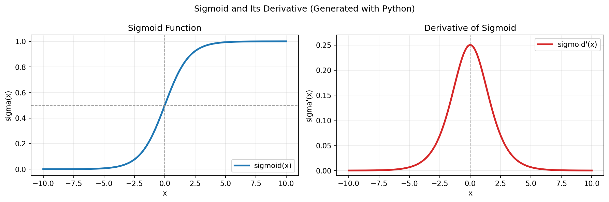

# Sigmoid Function and Its Derivative

## 1. What is the Sigmoid Function?

The sigmoid function is a mathematical function that squashes any real number into a value between **0 and 1**.

### Formula:

$$
\sigma(x) = \frac{1}{1 + e^{-x}}
$$

### Key Points:
- Takes **any real number** as input
- Returns a value between **0 and 1**
- Commonly used for **probabilities** in machine learning
- The output can be interpreted as: "What's the probability of class 1?"

---

## 2. Sigmoid Function Graph

The graph below is generated using Python (NumPy + Matplotlib):

### What the graph tells us:

| Input (x) | Output σ(x) | Meaning |
|-----------|-------------|---------|
| **-∞**    | **0**       | Definitely class 0 |
| **-5**    | **0.007**   | Very likely class 0 |
| **-1**    | **0.27**    | Slightly likely class 0 |
| **0**     | **0.5**     | Decision boundary (equal probability) |
| **1**     | **0.73**    | Slightly likely class 1 |
| **5**     | **0.993**   | Very likely class 1 |
| **+∞**    | **1**       | Definitely class 1 |

---

## 3. What Does "Derivative" Mean?

The derivative tells us how **fast** the output changes when the input changes slightly.

**In simple words:** How steep is the curve at each point?

- **Steep curve** = Large derivative = Output changes a lot
- **Flat curve** = Small derivative = Output changes little

---

## 4. The Derivative of Sigmoid (The Important Formula)

The derivative of the sigmoid function is beautifully simple:

$$
\sigma'(x) = \sigma(x)(1 - \sigma(x))
$$

**What this means:**
- Derivative = Output × (1 − Output)
- You can compute it from the sigmoid output itself!

### Why This is Special:

- Most derivatives are **complicated**
- Sigmoid's derivative is **simple and elegant**
- You can **reuse** the sigmoid output
- This is why sigmoid is popular in neural networks

---

## 5. Derivative Example

If the sigmoid output is **0.8**:

$$
\sigma'(x) = 0.8 \times (1 - 0.8) = 0.8 \times 0.2 = 0.16
$$

If the sigmoid output is **0.5**:

$$
\sigma'(x) = 0.5 \times (1 - 0.5) = 0.5 \times 0.5 = 0.25 \text{ (MAXIMUM)}
$$

If the sigmoid output is **0.1**:

$$
\sigma'(x) = 0.1 \times (1 - 0.1) = 0.1 \times 0.9 = 0.09
$$

---

## 6. Derivative Graph

The derivative curve is shown in the right-side plot in the same Python-generated figure above.

### Key Observations:

| Where | Slope | Why |
|-------|-------|-----|
| **x = 0** | **Maximum (0.25)** | Sigmoid is steepest in the middle |
| **x = -3 or 3** | **Small** | Sigmoid is flattening out |
| **x = ±∞** | **Zero** | Sigmoid is completely flat |

---

## 7. Intuition: Sigmoid vs Its Derivative

From the Python plot:
- Sigmoid is steepest around $x = 0$, where output is close to $0.5$.
- The derivative is largest in the middle and becomes very small near the edges.

**Simple Rule:**
- When sigmoid output is **near 0.5** → derivative is **large** (fast change)
- When sigmoid output is **near 0 or 1** → derivative is **small** (slow change)

---

## 8. Why It Matters in Machine Learning

- Used in **backpropagation**
- Helps update weights in neural networks

### The Vanishing Gradient Problem ⚠️

**Problem:** When the output is near 0 or 1:
- The derivative becomes very small (close to 0)
- Weight updates become tiny
- Learning becomes very slow
- This is called the **vanishing gradient problem**

**Solution:** Use other activation functions like ReLU that don't have this problem

---

## Summary Table

| Concept | Formula | Key Insight |
|---------|---------|------------|
| **Sigmoid** | \( \sigma(x) = \frac{1}{1 + e^{-x}} \) | Maps any value to [0, 1] |
| **Derivative** | \( \sigma'(x) = \sigma(x)(1 - \sigma(x)) \) | Reuses sigmoid output |
| **Max Derivative** | At x = 0 | \( \sigma'(0) = 0.25 \) |
| **Range** | 0 ≤ σ(x) ≤ 1 | Perfect for probabilities |
| **Decision Boundary** | At σ(x) = 0.5 | When x = 0 |